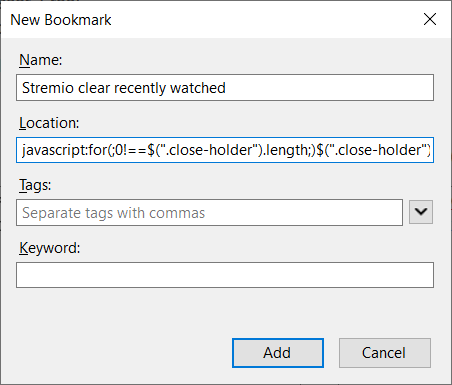

# clear-recently-watched
This script will remove all watched items under the 'Continue watching' section of the 'Board' tab.

## Usage
Open [https://app.strem.io/](https://app.strem.io/#/) in your browser. Make sure you are on the 'Board' page.
Next, open the browser developer tools (CTRL + SHIFT + i, F12 or form the browser menu) and  navigate to the 'Console' tab.
Paste the following script:
```
for(;0!==$(".close-holder").length;)$(".close-holder").each(function(){$(this).click()});
```
When you hit enter, all recently watched items should be removed automatically.
The code above is just a minified version of [this script](clear-recently-watched.js).

### Bookmarklets
You can also create a bookmark that executes the script when clicked.
Just create a new bookmark and paste the script above in the 'Location' or 'URL' field. 
Make sure to also put `javascript:` in front.

